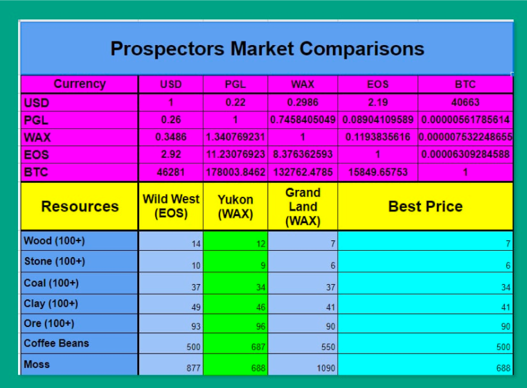

## What is the name of your Guild?

* name: WeCan
* bp_name_MAINNET: bp.wecan
* bp_name_TESTNET: wecan
* website: https://wecan.dev/
* keybase: https://keybase.pub/wecan_dev/

## Does your Guild have any new information to submit that impacts Technical Operations?

What has been done:
1. Upgraded Hyperion API cluster to 3.3.5 https://hyperion-wax-mainnet.wecan.dev/v2/health and added secondary node for backup
2. Deployed WAX daily backups with full history snapshots for testnet and mainnet https://backup.wecan.dev/ (non compressed, but it'll take less time to download then sync up from scratch or a history snapshot dated months ago)
3. Added CDN caching capabilities for https://ipfs.wecan.dev/ipfs/
4. Matching all the necessary technical criteria stated in https://www.notion.so/v4-Office-of-Inspector-General-Guidelines-ed0bddf9f11f424d8b6e371fa6e4d5ab

What we're working on right now:
1. Atomic API for testnet (it's somewhat complicated in terms of synchronization in testnet, but we're trying to fix this)
2. WIP on atomic postgres backups.

## Does your Guild have any new information to submit that impacts Product Development?

### Prospectors
* Status: **release**
* Daily active users (DAU): **7.28k**
* Monthly active users (MAU): **17.68k**
* Monthly trade volume (if your product has NFTs): **$134K**
* Website: https://prospectors.io
* Twitter: https://twitter.com/prospectorsgame **9633 Followers**
* Telegram Community: https://t.me/prospectorsgame **5.8K Followers**
* Medium page : https://prospectors.medium.com **2.2K Followers**
* Reddit: https://www.reddit.com/r/Prospectorsio/ **654 Members**

**Dappradar info**
* https://dappradar.com/rankings/protocol/wax/category/games
* https://dappradar.com/wax/games/prospectors

**Project development**

Developments on the line of resistance against bot scripts
One more feature was developed to fight against bot usage inside the game on March 21. The 4-second pause has been implemented after the actions, which relate to job orders, mining orders, or job orders for the player’s own workers. This should limit harm from using bot scripts from some unscrupulous players.

Launch of the Prospectors Help information service
Using the  Zendesk service, we formed an extended database of Prospectors metaverse where players can find all the information regarding the gameplay, game features, tokens, NFTs, and all the additional components of the Prospectors. Players can access the help both from the site and directly from the game. Also, players can contact the support team right from the help service.

### R-Planet
* Status: **release/ in development**
* Daily active users (DAU): **4.62k**
* Monthly active users (MAU): **13k**
* Monthly trade volume (if your product has NFTs): **$255K**
* Website: https://rplanet.io
* Twitter: https://twitter.com/RPLANETio **23.8K Followers**
* Telegram: https://t.me/rplanetio **7.5K Followers**
* Medium page: https://rplanet.medium.com **4.92K Followers**

**Dappradar info**
https://dappradar.com/wax/games/r-planet

**Project development: R-Planet Game**

Almost all the graphics for the game are done. We’ve been completing work on building and upgrading the base, production, and upgrade of units, extraction, and consumption of resources. There is active working development of the market, battles, alliances, integration with NFT assets. It's all on three platforms (ios, android, web).

### WAXSCAN
**WAX Block Explorer**
* Status: **release/ in development**
* Website: https://waxscan.wecan.dev/

Fixed filters for actions.

## Does your Guild have any new information to submit that impacts Ecosystem Development?

**miningnetwork.io**
The WeCan team took part in the development of the WAX blockchain game Mining network  https://miningnetwork.io/.
The company's specialists provided consulting support, audited the smart contract, and set up the collection at the Atomic Hub.

## Does your Guild have any new information to submit that impacts Community Engagement?

**1) WECAN dev team WAX community**

WECAN launched the NFT collection “WECAN” Schema Name standwithukr. Buyers of which support the struggle of brave Ukrainian people. The sale was scheduled for 7 pm UTC, March 7. Purchase here! The sale is unlimited in time. It will end when Ukrainians will expel the occupiers from our land.

**2) Prospectors WAX community**

Prospectors Game Discord Server live on @JoinTopgg! https://top.gg/servers/564752396408848384  was set up.
Added new sections in Prospectors Game Discord. It includes coin prices of all users favorite coins, games and bot commands, polls, music, Daily market prices, Instructional links, and more.

**3) R-Planet WAX community**

**The 10 Ambassadors program for R-Planet**

The 10 Ambassadors program for R-Planet was introduced on April 1 (https://rplanet.medium.com/welcome-to-the-r-planet-ambassadors-club-55e520a32e57).
This program has been arranged to stimulate projects listed within the R-Planet Staking Hub to promote R-Planet and the whole wax ecosystem in various ways. Such as publication within social media, different cross-project cooperations, NFT blends, development of useful tools, etc.
All the projects listed within Staking Hub can participate. Ten projects, which will have made the greatest effort and been able to provide a report confirming, are going to be supported on the Staking Hub with 2.5 billion Aether each by WECAN.
We believe the Ten Ambassadors Program will expand the connection between different WAX projects and grow our community.

**New projects have been added to the Staking Hub**

A few more projects have been added to the R-Planet Staking Hub. Every project listed on the R-Planet brings its users to R-Planet, making them a part of our community and a part of the WAX community as well.
Also, projects compete with each other for a bigger Aether mining pool encouraging their users to vote for them with Aether. That increases Aether usage and expands the amount of Aether holders.

List of the projects added to the staking Hub during the period since the last report: Digital Ducks, NKCSS, Gnome Series, WECAN, Blkchancards, Chronaverse1, MaxyLab Multichain, Future's Relic, SENORLUPE, Corporate World, Gods And Legends.

Launch of the REVOTE feature on the Staking Hub. Thanks to it, players have no need to wait 30 days to revoke their vote if they have changed their minds and would like to vote for another project. They can redirect Aether used for their vote to another project instantly.
Launch of the PROJECT INFO and STAKING SCHEMA features within the Staking Hub. Thanks to this, players can learn some info about the project and which of its NFTs can be staked in order to mine Aether right on the Staking Hub.
Launch of additional elements to the laboratory. On March 7, twenty-six brand-new elements became available to be invented in the R-Planet laboratory.

**Live show**
We hosted Aether Burn Spectacular Party in the weekly R-Planet AMA https://www.twitch.tv/videos/1435552710

## Do you have any feedback for improving the Office of Inspector General, the Inspector General Guidelines, or this form?

Nothing to report. Thanks for your good work!
