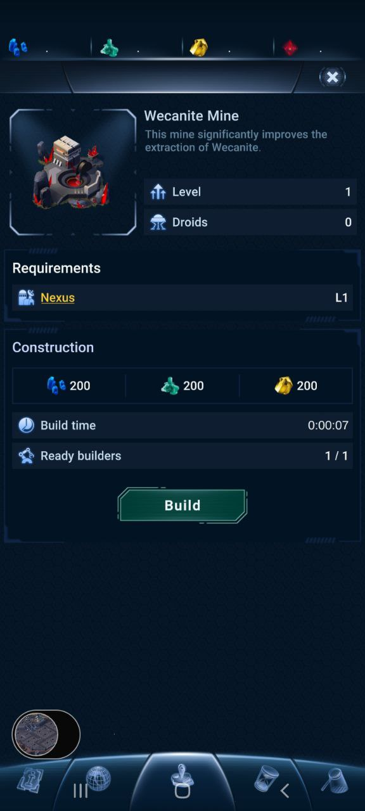
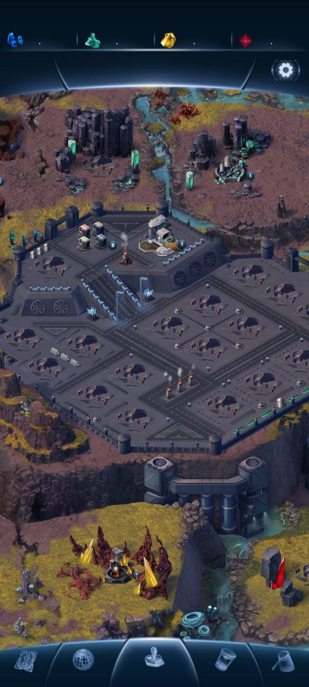
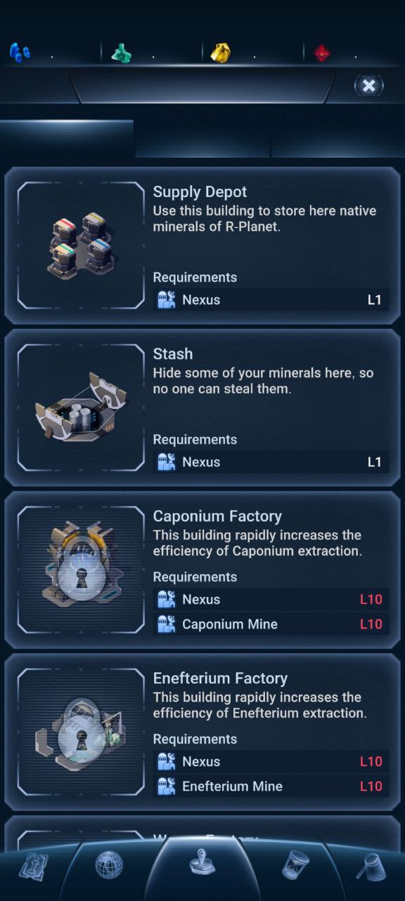
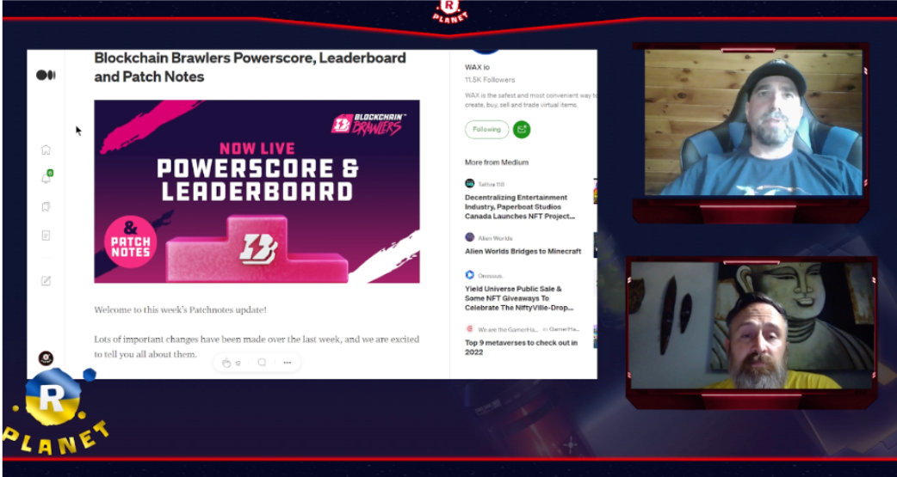

## What is the name of your Guild?

* name: WeCan
* bp_name_MAINNET: bp.wecan
* bp_name_TESTNET: wecan
* website: https://wecan.dev/
* keybase: https://keybase.pub/wecan_dev/

## Does your Guild have any new information to submit that impacts Technical Operations?

What has been done:
1. Upgraded infra to 2.0.14wax01 with subjective billing enabled
2. Maintenance and upgrades for resilience of the backup service while keeping it available
3. Built and deployed WAX Mandel docker (wecandev/waxblockchain:v3.1.0wax01) in our internal testnet infra
4. Took part in WAX degradation resolution with other guilds during the time when the August reports had to be filed
5. Started improvements of our internal peering system for internal and public WAX infrastructure
6. Doing our best to provide public full history hyperions for testnet and mainnet
7. Successfully keeping up with all the technical requirements from https://wax-oig.notion.site/v4-4-Office-of-Inspector-General-Guidelines-0bb30678ca4a46f89d904efc83e7a3e9

WIP:
1. Upgrades of internal peering infrastructure to increase WAX resilience
2. Testing in production for nodeos 3.x branch

## Does your Guild have any new information to submit that impacts Product Development?

### Prospectors
* Status: **release**
* Daily active users (DAU): **4.96k**
* Monthly active users (MAU): **10.28k**
* Monthly trade volume (if your product has NFTs): **$32.79K**
* Website: https://prospectors.io
* Twitter: https://twitter.com/prospectorsgame **9471 Followers**
* Telegram Community: https://t.me/prospectorsgame **4933 Followers**
* Medium page : https://prospectors.medium.com **2.2K Followers**
* Reddit: https://www.reddit.com/r/Prospectorsio/ **665 Members**
* Discord: https://discord.gg/Ru6SnXRZD8 **4062 Members**

**Dappradar info**
* https://dappradar.com/wax/games/prospectors

We published the first episode of official Prospectors tutorials, created in cooperation with Lemur's Corner on our YouTube Channel https://www.youtube.com/watch?v=RdTrbxdXKxA .  
The second episode (How to register in the game and enter with a WAX account) and third episode (First steps in the Grand Land) have already been made and will be published shortly.

### R-Planet
* Status: **release/ in development**
* Daily active users (DAU): **3.11k**
* Monthly active users (MAU): **7.68k**
* Monthly trade volume (if your product has NFTs): **$37.87K**
* Website: https://rplanet.io
* Twitter: https://twitter.com/RPLANETio **26.1K Followers**
* Telegram: https://t.me/rplanetio **6319 Followers**
* Medium page: https://rplanet.medium.com **5K Followers**
* Discord: https://discord.com/invite/VHV6QCUU5d **2366 Members**

**Dappradar info**
https://dappradar.com/wax/games/r-planet

The team finalized the development of a mobile application (Android and iOS).
We've configured production-ready servers and staging servers.
The app is ready for the testing phase.
We are beginning to adjust the application for running on the browser.

Website:
https://rplanet.app/

Some of the screenshots that leaked to the public:
  

### WAXSCAN
**WAX Block Explorer**
* Status: **release/ in development**
* Website: https://waxscan.wecan.dev/

No updates this month.

## Does your Guild have any new information to submit that impacts Ecosystem Development?

**WAX Backup services**
* Website: https://backup.wecan.dev/

Created support channel for help with WAX infra https://t.me/wecanwaxinfra dedicated to https://backup.wecan.dev/
Keeping Hyperion, WAX and Atomic snapshots recent and available.

**miningnetwork.io**
* Status: **released**
* Website: https://miningnetwork.io/
* Dappradar: https://dappradar.com/wax/games/miningnetwork

Our team implemented and integrated staking system and stake contract for the project.

## Does your Guild have any new information to submit that impacts Community Engagement?

We have held the Graduation Party of Inventors for our community by publishing a bunch of hints  (https://rplanet.medium.com/). For inventing the elements, players get WAX prize. Most of the hints were published on our Discord channel.

Also, to engage the community in our Discord channel, we held the Gartic Contest there (https://twitter.com/RPLANETio/status/1555117735222415366).

We prepared and published an explanation article of the future role and use cases of native R-Planet token Aether  https://rplanet.medium.com/conquest-era-begins-but-what-role-will-aether-play-e0aaea80f392/ .

We have weekly live streams https://www.twitch.tv/rplanet with different guests like ambassadors of R-Planet.
R-Planet ambassador & team member of DogoTogoNFT, Cardinal Land's Petro told the story of their collection, about amazing artwork, and a Japanese influence. Video is here https://www.youtube.com/watch?v=hHpH95GyMCk.  

 Lately we added in these streams the rubric WAX news.

We announced the date of starting a closed alpha R-Planet game - https://nfthorizon.io/the-launch-of-the-real-time-military-game-r-planet-approached/.
1000 first gamers will be chosen via lottery. Lottery tickets can be bought for the native R-Planet token Aether. The 1000 test players will play “every player for themselves” until only 100 players remain. The 100 winners of the closed alpha will receive a super unique Hero NFT.

Also explained the rules on how to become one of the first 1000 testers of the game https://rplanet.medium.com/the-date-the-lottery-and-the-1000-brave-testers-4283d1e6c4f. We have started  the lottery sale, which is held here https://rplanet.io/lottery.

Communication manager of R-Planet Bonz Manifest attended this month the Live DappRadio and told their community about the upcoming game R-Planet https://twitter.com/DappRadar/status/1560348382249492484.

We prepared and published a short video about the R-Planet game to engage the player to take part in a lottery sale https://twitter.com/RPLANETio/status/1562779584323473408.

## Do you have any feedback for improving the Office of Inspector General, the Inspector General Guidelines, or this form?

No
