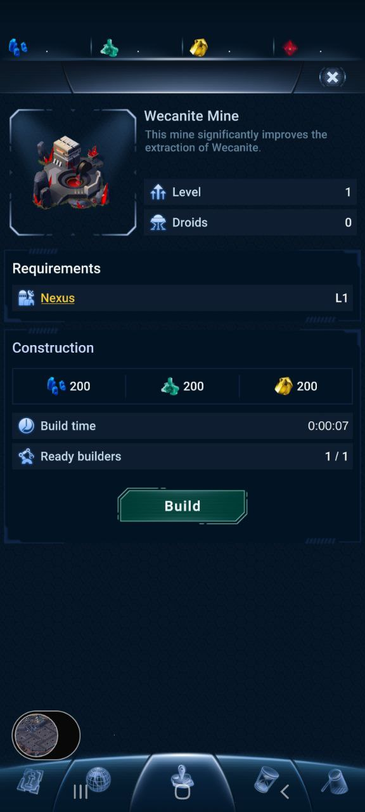

## What is the name of your Guild?

* name: WeCan
* bp_name_MAINNET: bp.wecan
* bp_name_TESTNET: wecan
* website: https://wecan.dev/
* keybase: https://keybase.pub/wecan_dev/

## Does your Guild have any new information to submit that impacts Technical Operations?

What has been done:
1. Successfully tested nodeos 3.1, over a month of production use in Prospectors, Rplanet and Miningnetwork without hiccups
2. Updated internal peering infrastructure for better block reliability
3. Successfully keeping up with all the technical requirements from https://wax-oig.notion.site/v4-4-Office-of-Inspector-General-Guidelines-0bb30678ca4a46f89d904efc83e7a3e9

WIP:
1. Working on private BP peering and endpoints
2. Testing new branches of 3.x nodeos
3. Maintenance of minion WAX mainnet hyperion server used for providing snapshots

## Does your Guild have any new information to submit that impacts Product Development?

### Prospectors
* Status: **release**
* Daily active users (DAU): **4.96k**
* Monthly active users (MAU): **10.28k**
* Monthly trade volume (if your product has NFTs): **$32.79K**
* Website: https://prospectors.io
* Twitter: https://twitter.com/prospectorsgame **9471 Followers**
* Telegram Community: https://t.me/prospectorsgame **4933 Followers**
* Medium page : https://prospectors.medium.com **2.2K Followers**
* Reddit: https://www.reddit.com/r/Prospectorsio/ **665 Members**
* Discord: https://discord.gg/Ru6SnXRZD8 **4062 Members**

**Dappradar info**
* https://dappradar.com/wax/games/prospectors

TBD

### R-Planet
* Status: **release/ in development**
* Daily active users (DAU): **3.11k**
* Monthly active users (MAU): **7.68k**
* Monthly trade volume (if your product has NFTs): **$37.87K**
* Website: https://rplanet.io
* Twitter: https://twitter.com/RPLANETio **26.1K Followers**
* Telegram: https://t.me/rplanetio **6319 Followers**
* Medium page: https://rplanet.medium.com **5K Followers**
* Discord: https://discord.com/invite/VHV6QCUU5d **2366 Members**

**Dappradar info**
https://dappradar.com/wax/games/r-planet

The team successfully launched the mobile application (Android and iOS) of the R-Planet game. Nearly 700 testers take part in the closed version of the game. So far the feedback from them is excellent. Using the NFTs in the App is smooth and easy.
We’ve been doing bugfixes and updates in the App. There were IPADs adoption,  update of Market UI, leaderboard page, etc. We implemented an upgrade cancellation and fixed some minor bugs.  
New features like alliances, ingame chats and others are being developed now for the next server. Also the devs have been working on adjusting the application for running on the browser.

Website:
https://rplanet.app/

Some of the screenshots that leaked to the public:
  

### WAXSCAN
**WAX Block Explorer**
* Status: **release/ in development**
* Website: https://waxscan.wecan.dev/

No updates this month.

## Does your Guild have any new information to submit that impacts Ecosystem Development?

**WAX Backup services**
* Website: https://backup.wecan.dev/

Created support channel for help with WAX infra https://t.me/wecanwaxinfra dedicated to https://backup.wecan.dev/
Keeping Hyperion, WAX and Atomic snapshots recent and available.

**miningnetwork.io**
* Status: **released**
* Website: https://miningnetwork.io/
* Dappradar: https://dappradar.com/wax/games/miningnetwork

Our team implemented and integrated staking system and stake contract for the project.
Connected to WeCan API services for improved performance and stability.

## Does your Guild have any new information to submit that impacts Community Engagement?

To create awareness of the R-Planet game we created a lot of promo materials. There were educational materials such as articles, Twitter posts, academy in Discord and the detailed tutorial video.

We published five parts of How-to-play articles.
How to Play Closed Alpha Part 1. First Steps
How to Play Closed Alpha Part 2. Minerals
How to play closed Alpha? Part 3. Troops
How to Play Closed Alpha Part 4. Defending your Base
How to Play Closed Alpha Part 5. Expansion of your bases network

The video tutorial was published on the R-Planet YouTube channel https://www.youtube.com/watch?v=X8ULmvRU-d0&t=77s

Also we updated the R-Planet Whitepaper to align it with the actual game https://static.rplanet.io/WhitePaper.pdf.   

We have weekly livestreams https://www.twitch.tv/rplanet. The host, communication manager Bonz invites the top players of R-Planet to share their impressions and skills with others.

To increase the popularity of new R-Planet games we had collaborations with other projects, influencers and media. The CEO of WECAN gave an exclusive interview to NFT Insider, shared his experience in blockchains and told the readers of the media about R-Planet and Prospectors games https://nftinsider.io/exclusive-an-interview-with-wecan-r-planet-ceo-nazar-chervinskyy/.

NFT Horizon published the article about R-Planet App launching https://nfthorizon.io/r-planet-mmorts-game-will-be-launched-on-closed-alpha/. They explained for its readers the details of the R-Planet alpha lottery, how to play the game, and the RDAO role in the future.

The access to the closed Alpha game got the influencers, journalists and WAX ambassadors. Some of them have already made reviews at the R-Planet game. Here are some of them

https://www.youtube.com/watch?v=fK8AbSDuKXo
https://www.youtube.com/watch?v=PruAO5dL25Y
https://www.youtube.com/watch?v=8yQQM5n0E10&t=1098s
https://www.youtube.com/watch?v=7to8Fxfn0uQ
https://www.youtube.com/watch?v=P3xGQ7BoEZU

The R-Planet game was called one of the best P2E NFT Games on WAX Blockchain in October https://nfthorizon.io/best-p2e-nft-games-on-wax-blockchain-in-october/ .

The journalist Phil Hall shared his impressions from the game at the Play to Earn Media  R-Planet: Conquest Launches First Alpha.  

R-Planet was represented at bimonthly metaverse experience hosted by
Splinterlands DYGYCON 11. The R-Planet booth was located in the NFT Horizon hall.

## Do you have any feedback for improving the Office of Inspector General, the Inspector General Guidelines, or this form?

No
