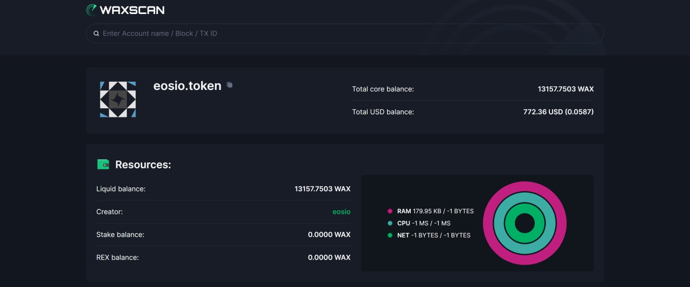
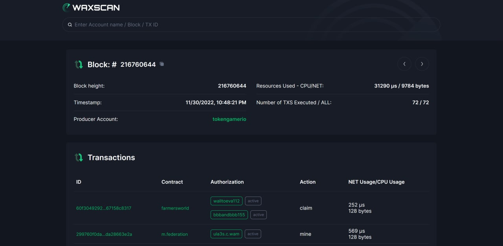

## What is the name of your Guild?

* name: WeCan
* bp_name_MAINNET: bp.wecan
* bp_name_TESTNET: wecan
* website: https://wecan.dev/
* keybase: https://keybase.pub/wecan_dev/

## Does your Guild have any new information to submit that impacts Technical Operations?

What has been done:
1. Performed planned maintenance of public resources: https://backup.wecan.dev, https://ipfs.wecan.dev, https://hyperion-wax-mainnet.wecan.dev
2. Deployed new set of p2p nodes for internal communication
3. Successfully keeping up with all the technical requirements from https://wax-oig.notion.site/v4-6-Office-of-Inspector-General-Guidelines-DRAFT-43ce3fac59144e5795d4c59024ce484c

WIP:
1. Expose new peers for private BP peer sharing

## Does your Guild have any new information to submit that impacts Product Development?

### Prospectors
* Status: **release**
* Daily active users (DAU): **4.63k**
* Monthly active users (MAU): **8.77K**
* Monthly trade volume (if your product has NFTs): **$17.25K**
* Website: https://prospectors.io
* Twitter: https://twitter.com/prospectorsgame **9355 Followers**
* Telegram Community: https://t.me/prospectorsgame **4420 Followers**
* Medium page : https://prospectors.medium.com **2.2K Followers**
* Reddit: https://www.reddit.com/r/Prospectorsio/ **672 Members**
* Discord: https://discord.gg/Ru6SnXRZD8 **4166 Members**

**Dappradar info**
* https://dappradar.com/wax/games/prospectors

No updates this month.

### R-Planet (rplainet.io alchemy game, stacking system, rdao)
* Status: **release/ in development**
* Daily active users (DAU): **4.34k**
* Monthly active users (MAU): **8.23k**
* Monthly trade volume (if your product has NFTs): **$29.98k**
* Website: https://rplanet.io
* Twitter: https://twitter.com/RPLANETio **28.575K Followers**
* Telegram: https://t.me/rplanetio **6007 Followers**
* Medium page: https://rplanet.medium.com **6041 Followers**
* Discord: https://discord.com/invite/VHV6QCUU5d **3632 Members**

### R-Planet MMO Strategy game (Early Access Alpha)
Website:
https://rplanet.app/

App:
https://play.google.com/store/apps/details?id=dev.wecan.rplanet
https://apps.apple.com/es/app/r-planet/id1625678981

On __November 17__ we launched the playground server of the R-Planet game.
The game can now be downloaded on mobile or tablet devices from https://rplanet.app/.

This type of server is available for everyone.
It doesn’t have NFT prizes, but all other features (like NFT usage, attacking, spying, robbery) are available.

Team has been doing bug fixes and updates in the R-Planet App:
There were localization of Spanish and Ukrainian languages, writing next server configuration and game rules, adding categories for mobile notifications, implementing heroes and alliance functionality, implementing player scores by combat, implementing combat calculator, creating inventory page, implementing in-game messaging, implementing event filtering, implementing push notification UI etc.

The team conducted the Starter Box Sale - https://rplanet.io/drop?ids=22-23.
The Starter Pack is a set of NFT assets that will make playing the game smoother and more convenient for players.
It consists of 20 Resource Assets: 5 assets of each Mineral, each containing 5k minerals, 5 Instant finish of building/upgrading assets, 3 x 24-hour Protection Dome assets, 2 assets of Additional foundations.  

**Dappradar info**
https://dappradar.com/wax/games/r-planet

### WAXSCAN
**WAX Block Explorer**
* Status: **release/ in development**
* Website: https://waxscan.wecan.dev/

Working on new design protorype:

## Does your Guild have any new information to submit that impacts Ecosystem Development?

**WAX Backup services**
* Website: https://backup.wecan.dev/

We keep supporting this resource with the latest backups as usual.

**miningnetwork.io**
* Status: **released**
* Website: https://miningnetwork.io/
* Dappradar: https://dappradar.com/wax/games/miningnetwork

Our team helped to implement a mechanism designed to balance economic model and it's in experimental state.
We're executing A/B tests to get more telemetry and feedback.

## Does your Guild have any new information to submit that impacts Community Engagement?

**R-Planet**

The testing phase of the closed R-Planet game has ended. We announced the 100 winners who will be awarded with 100 NFTs of Heroes (https://rplanet.medium.com/the-closed-alpha-has-ended-congratulations-to-the-100-survivors-9d936b22af96). Almost 700 hundred players actively took part in it. They wrote a lot of feedback, they performed  248 361 combats, and implemented into the game almost 2 millions robots from NFTs (more stats from the first Alpha are available here https://rplanet.medium.com/r-planet-conquest-closed-alpha-in-figures-and-facts-d185e1e4a1b2).

To engage the players into the game we determined the special nomination for most active ones, calling it Superkiller list (https://twitter.com/RPLANETio/status/1587137027736305664).

We updated the list of events that should be closely watched and joined by the R-Planet community - https://rplanet.medium.com/life-after-closed-alpha-exists-6b9e3d997158.

WECAN team announced the sale of Startet Boxes and explained the community why it will be useful in the next servers of the game - https://rplanet.medium.com/starter-packs-sale-get-ready-for-the-open-alpha-dfb3ec3c6851.

Also we published the article with the detailed announcements of the Open Alpha which is launching in January 2023 - https://rplanet.medium.com/r-planet-conquest-open-alpha-a-glimpse-into-the-future-fbbafe374baf. This news had a lot of sharing:
https://playtoearn.net/en/news/r-planet-conquest-open-alpha-to-launch-in-january-2023,  https://defi-play.com/play-to-earn/r-planet-conquest-open-alpha/б https://www.playtoearn.online/2022/11/23/r-planet-conquest-open-alpha/, https://cryptoshitcompra.com/r-planet-conquest-open-alpha-juega-para-ganar.

We had weekly livestreams https://www.twitch.tv/rplanet. The host, communication manager Bonz invites the top players of R-Planet to share their impressions and skills with others.

R-Planet was represented at bimonthly metaverse experience hosted by
Splinterlands DYGYCON 12 (https://inverse.app/events/63365a6113c6e0040ce0936f). The R-Planet booth was located in the NFT Horizon hall.  

## Do you have any feedback for improving the Office of Inspector General, the Inspector General Guidelines, or this form?

No
